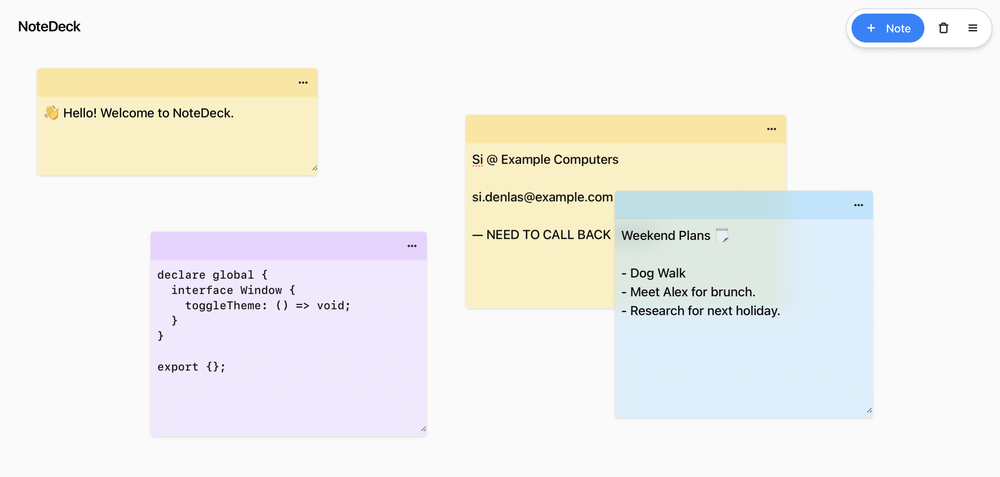

# NoteDeck

>)
>)

🚀 Start using NoteDeck at **[notedeck.dev](https://app.notedeck.dev)**

**NoteDeck is a free and open-source alternative to paper notes that respects your privacy and works offline.** Built with Vite and React, your notes are persisted locally to your device as part of your browser's site storage using the [IndexedDB API](https://developer.mozilla.org/en-US/docs/Web/API/IndexedDB_API).

Help improve NoteDeck! Use [GitHub Issues](https://github.com/abiddiscombe/notedeck/issues) to record bugs or suggest new features.

## Key Features

- Light and Dark Modes.
- Backup & Restore Capability.
- Installable as a Progressive Web App.
- Resizable "sticky notes" with support for multiple themes.

## Core Dependencies

- Built with [React](https://react.dev) using [Vite](https://vitejs.dev).
- [React-Draggable](https://www.npmjs.com/package/react-draggable).
- [IndexedDB](https://developer.mozilla.org/en-US/docs/Web/API/IndexedDB_API) with [Dexie](https://dexie.org/).
- [TailwindCSS](https://tailwindcss.com/), [Hero Icons](https://heroicons.com/), [Headless UI](https://headlessui.com/).
- Visual assets by [Favicon Generator](https://favicon.io/) and [Undraw Illustrations](https://undraw.co/illustrations).
