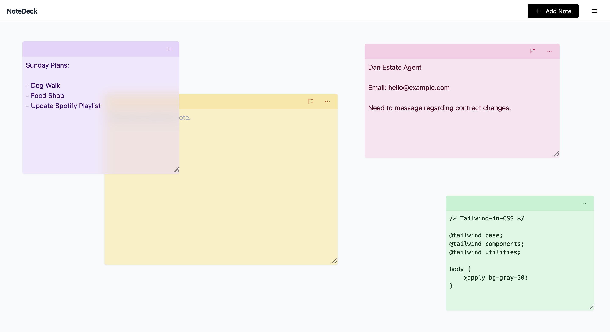

# NoteDeck

**[notedeck.dev](https://app.notedeck.dev)**

NoteDeck is a React-based browser app for tracking thoughts on virtual draggable "sticky notes", it's designed for jotting down quick notes, tasks, or code snippets.

The app uses [IndexedDB](https://developer.mozilla.org/en-US/docs/Web/API/IndexedDB_API) to store a user's notes and settings locally to their browser storage, and does not require a user account to use. It is also installable as a Progressive Web App (PWA).

NoteDeck is built using:

-   [React](https://react.dev) & [Vite](https://vitejs.dev)
-   [React-Draggable](https://www.npmjs.com/package/react-draggable)
-   [IndexedDB](https://developer.mozilla.org/en-US/docs/Web/API/IndexedDB_API) (via [Dexie](https://dexie.org/))
-   [TailwindCSS](https://tailwindcss.com/) (with [Hero Icons](https://heroicons.com/) and [HeadlessUI](https://headlessui.com/))
-   [Favicon Generator](https://favicon.io/)
-   [Undraw Illustrations](https://undraw.co/illustrations)
